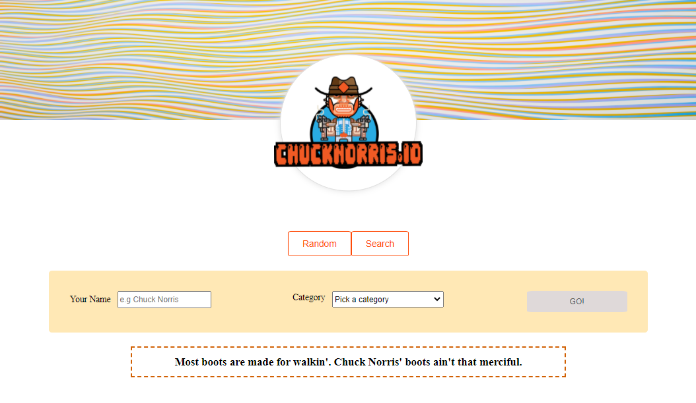

# chuck-norris-rest-api

Web application that generates Chuck Norris facts.

2 Buttons: <br/>
* Random button: <br/>
Display a random fact according to given input (name and categories) - ability to select multiple categories.

* Search button: <br/>
Search for Chuck Norris facts and display the results in a grid. <br/>
Ability Sort facts list by "created_at" field.

Frontend: React & Html & Css <br/>
Backend: NodeJS & Express <br/>
Api: Chuck Norris - https://github.com/chucknorris-io/chuck-api 

## Run application
```bash
cd frontend
npm run dev
```
<br/>

<kbd></kbd>


